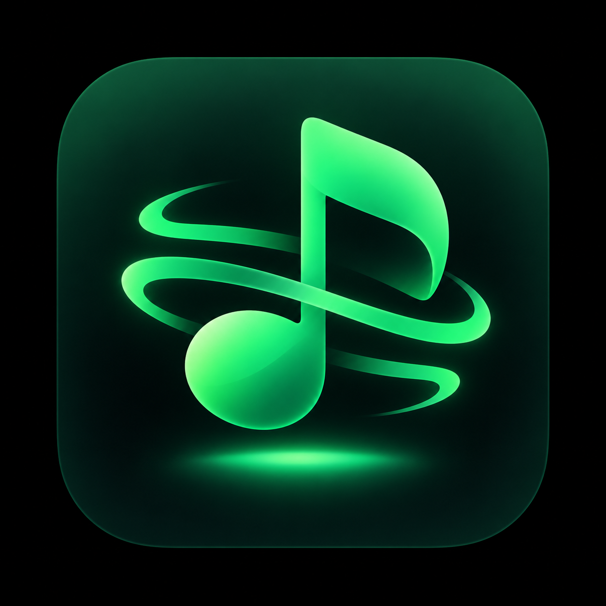
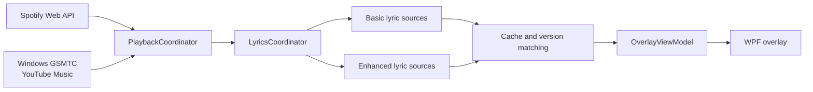

<div align="center">
  
  <h1>FloatSpotify Next</h1>
  <p><strong>Keep the lyrics on your desktop and the music in sight.</strong></p>
  <p>A lightweight, transparent and customisable lyric overlay for Windows, with Spotify and YouTube Music support.</p>
  <p>
    <a href="https://www.microsoft.com/windows"></a>
    <a href="https://dotnet.microsoft.com/"></a>
    <a href="https://learn.microsoft.com/dotnet/desktop/wpf/"></a>
    <a href="LICENSE"></a>
  </p>
  <p>
    <a href="README.md">简体中文</a> ·
    <strong>English</strong>
  </p>
  <p>
    <a href="https://github.com/SISUBEN/FloatSpotifyNext/releases/latest"><strong>Download the latest release</strong></a> ·
    <a href="#quick-start">Quick start</a> ·
    <a href="#spotify-setup">Spotify setup</a> ·
    <a href="#development">Development</a>
  </p>
</div>

---

## Why FloatSpotify Next?

| 🎵 Immersive lyrics | ✨ Word-level sync | 🪶 Lightweight and native |
| :--- | :--- | :--- |
| Transparent, always on top and freely draggable, so you can sing along without switching windows. | Smooth sweep highlighting when a word-level timeline exists, with an automatic fall back to line lyrics when it does not. | Native .NET 8 + WPF. No Python service and no extra UI framework. |
| **🎧 Two playback sources** | **🎨 Highly customisable** | **🖱️ Unobtrusive interaction** |
| Spotify and YouTube Music, switchable with one click. | Font size, colour, glow, opacity, width and position are all adjustable. | Locking makes it click-through; the tray menu brings it back, unlocks it or exits at any time. |

### Highlights

- **Layered lyric experience**: word-level sync → line sync → unsynced full text, degrading naturally with the available data quality.
- **Smart lyric matching**: combines title, artist, duration and version information to reduce the chance of a wrong version overwriting the right lyrics.
- **Multi-source race with fault tolerance**: basic sources show up first and enhanced sources upgrade asynchronously; a single failing service never interrupts playback.
- **Per-song offset**: every song keeps its own ±5 second calibration.
- **Position presets**: free drag, top/bottom centre, screen centre and the four corners.
- **Single instance and tray**: a second launch is reported, and a hidden overlay can be restored from the system tray.

## Quick start

### 1. Download

Go to [Releases](https://github.com/SISUBEN/FloatSpotifyNext/releases/latest) and pick the package that fits your situation:

| Variant | When to use it | .NET 8 Desktop Runtime |
| :--- | :--- | :---: |
| `setup-online.exe` | Recommended; smallest download, fetches the runtime during setup | Detected automatically |
| `setup-offline.exe` | Offline installation or bulk deployment | Bundled |
| `portable.zip` | Portable, extract and run | Bundled |
| `framework.zip` | You already have .NET 8 and want the smallest download | Must be installed |

> [!IMPORTANT]
> Both ZIP variants must be fully extracted before you run `FloatSpotify.Next.exe`. Do not launch it from inside the archive.

### 2. Choose a playback source

- **YouTube Music**: no Google authorization required. The app reads the playback state of Chrome, Edge, Firefox, Brave, Opera, Vivaldi or the YouTube Music PWA through the Windows system media session.
- **Spotify**: uses the official Web API with PKCE authorization and requires your own Spotify Client ID.

### 3. Start using it

| Action | Effect |
| :--- | :--- |
| Click the lyrics | Open or collapse the control bar |
| Drag the lyrics | Move the overlay |
| Adjust "Lyric width" | Set the overlay width between 160 and 1600 px |
| Click lock | Enable click-through so it never blocks anything |
| Right-click the tray icon | Show lyrics, open settings, unlock, re-authorize or exit |

## Spotify setup

FloatSpotify Next uses the official Spotify Web API. No developer Client ID ships with the app, and no Client Secret is needed.

1. Sign in to the [Spotify Developer Dashboard](https://developer.spotify.com/dashboard).
2. Click **Create app**; if it asks which API you need, choose **Web API**.
3. Under the app's **Settings → Redirect URIs**, add:

   ```text
   http://127.0.0.1:8888/callback
   ```

4. Save and copy the 32-character **Client ID** shown on the page.
5. Open the FloatSpotify Next settings and paste the Client ID into the field.
6. Click "Authorize Spotify with this Client ID" and finish signing in through your browser.

The Client ID is stored in the user environment variable `FLOATSPOTIFY_SPOTIFY_CLIENT_ID` and never written into the program directory. The authorization session is kept in the current user's local application data folder.

> [!TIP]
> The `?` button in the settings opens the in-app setup guide at any time. Using your own Spotify app also avoids the publisher account's allow-list limits.

## Data and privacy

Settings, the Spotify session and the lyric cache stay on your machine:

```text
%LocalAppData%\FloatSpotify.Next\
├─ settings.json          # Interface and behaviour settings
├─ spotify-session.json   # Spotify authorization session
└─ lyrics\                # Lyric cache, split by source, artist, title and duration
```

Uninstalling the app does not delete that folder, so a reinstall usually needs no new authorization. Delete the folder by hand if you want it gone for good.

## How it works



<details>
<summary><strong>How lyrics are fetched, matched and degraded</strong></summary>

- Enabled basic sources (LRCLIB / optional NetEase) return usable lyrics first, then the Karalyr / Better Lyrics enhancement sources try to upgrade them to word-level results. Sources of the same class follow the user's ordering; nothing is requested when all of them are off.
- Tracks explicitly marked English / Chinese / Japanese / Korean Ver. have both the returned title and the lyric script checked, so a wrong language cannot overwrite a correct result that merely has a lower sync level. The full version title takes part in the cache key.
- Each source has a 3 second timeout by default. `404`, `401`, empty results, network failures and parse errors are isolated; `429` respects `Retry-After` and enters a short cooldown.
- When the current song has no lyrics it is rechecked every 30 seconds, subject to the rate-limit cooldown and a 5 minute miss cache.
- Word-level results are cached for 7 days, line-level results for 1 day. The cache is keyed by source, artist, title and duration.
- When Enhanced LRC is missing the end time of the last word, the next line or the end of the song is used as the boundary; if no boundary is available it falls back to line level rather than inventing an average word duration.
- TTML supports absolute clocks, grouped `begin` / `end` and nested word-level `span`, and preserves whitespace. Background vocals and translations never leak into the lead line.
- Unsynced lyrics are still shown as scrollable plain text; with no text at all the app shows the song information and an automatic retry hint.

Lyric format and API references: [Karalyr docs](https://www.karalyr.com/docs), [Better Lyrics response format](https://lyrics-api-docs.boidu.dev/docs/response-format/), [Better Lyrics authentication](https://lyrics-api-docs.boidu.dev/docs/authentication/). Actual word-level coverage depends on the upstream services.

</details>

## Development

### Requirements

- Windows 10 build 17763 (1809) or later
- [.NET 8 SDK](https://dotnet.microsoft.com/download/dotnet/8.0)
- Visual Studio 2022 (optional, for XAML design and debugging)

### Clone and build

```powershell
git clone https://github.com/SISUBEN/FloatSpotifyNext.git
cd FloatSpotifyNext
dotnet build src/FloatSpotify/FloatSpotify.csproj -c Release
```

You can also open `FloatSpotify.Next.sln` in Visual Studio.

### Project layout

```text
FloatSpotifyNext/
├─ src/FloatSpotify/
│  ├─ Localization/   # Interface string table and runtime language switching
│  ├─ Playback/       # Playback engines, lyric sources, parsing, matching and caching
│  ├─ ViewModels/     # MVVM state and commands
│  ├─ Windows/        # Overlay, control bar, settings and custom rendering
│  ├─ Storage/        # Settings model and persistence
│  └─ Assets/         # Application icon and other static resources
├─ tests/             # Executable regression suite with no test framework dependency
├─ build/             # Release and packaging scripts
├─ installer/         # Inno Setup configuration
└─ artifacts/         # Locally generated test evidence and release artifacts
```

To add a playback source, implement `IPlaybackEngine`, extend `PlaybackSource`, and wire it into `PlaybackCoordinator`. To add a lyric source, implement `ILyricsProvider` and register it with `LyricsCoordinator`.

Interface text lives in `src/FloatSpotify/Localization/Strings.cs` as a single
`key -> (Chinese, English)` table. Use `{loc:Tr Key}` in XAML and `Loc.T("Key")` in code;
both follow the language the user picks in the settings, with no restart.

### Running the regression suite

```powershell
dotnet run --project tests/FloatSpotify.Lyrics.Tests -c Release -- artifacts/lyrics-word-sync
```

The suite covers simulated HTTP, lyric parsing, caching, settings migration, playback
timelines and WPF pixel verification. Add `--i18n-probe` to build the real windows and
verify that the interface actually switches language. The generated render evidence uses
synthetic test lyrics and does not represent real-song hit rates or player end-to-end
acceptance.

### Commit convention

The project follows Conventional Commits:

```text
feat(lyrics): add word-level timing
fix(playback): preserve position after source switch
docs: improve Spotify setup guide
```

Run the following script to enable the commit template and validation hook for this clone:

```powershell
./tools/setup-git-hooks.ps1
```

Full rules are in [COMMIT_CONVENTION.md](COMMIT_CONVENTION.md); project constraints aimed at coding agents are in [AGENT.md](AGENT.md).

## Building release packages

Building the installers also needs [Inno Setup 6](https://jrsoftware.org/isdl.php):

```powershell
winget install JRSoftware.InnoSetup
powershell -ExecutionPolicy Bypass -File build/build-release.ps1
```

The script reads `<Version>` from `src/FloatSpotify/FloatSpotify.csproj` and produces the following in `artifacts/`:

```text
FloatSpotifyNext-x86_64-v<version>-setup-online.exe
FloatSpotifyNext-x86_64-v<version>-setup-offline.exe
FloatSpotifyNext-x86_64-v<version>-portable.zip
FloatSpotifyNext-x86_64-v<version>-framework.zip
```

- Use `-Version 1.2.0` to override the project version temporarily.
- Use `-SkipInstallers` to produce only the two ZIP packages.
- When changing the product or architecture name you must update both `build/build-release.ps1` and `installer/FloatSpotify.Next.iss`.

> [!NOTE]
> WPF does not support `PublishTrimmed`. The self-contained build already shrinks its size by limiting framework satellite resources; most of the remaining space is the .NET runtime and the WinRT projections YouTube Music needs.

## Known limitations

- Only a Windows x64 build is available today.
- There is no auto-update yet; upgrading means running the installer again or replacing the portable files.
- Obscure songs may have no usable lyrics, and word-level coverage depends on the upstream sources.
- YouTube Music relies on the Windows system media session; when several browser tabs play at once the wrong session may be selected.

## Acknowledgements

- The project started as a fork of [BitsJayMehta173/FloatSpotify](https://github.com/BitsJayMehta173/FloatSpotify). The original Python Flask backend has been removed and replaced with a native .NET rewrite.
- Lyric data and format support come from upstream services including LRCLIB, NetEase, Kugou, Karalyr and Better Lyrics.
- Thanks to everyone who reports issues, tests lyric matching and improves the desktop experience.

## License

Released under the [MIT License](LICENSE).

<div align="center">
  <sub>Built with ♫ for people who like their lyrics close.</sub>
</div>
