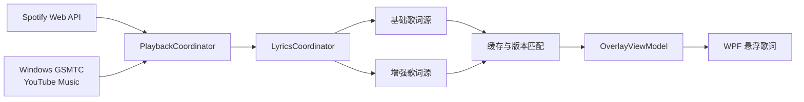

<div align="center">
  
  <h1>FloatSpotify Next</h1>
  <p><strong>让歌词悬浮在桌面，让音乐始终留在眼前。</strong></p>
  <p>一款轻量、透明、可定制的 Windows 桌面歌词组件，支持 Spotify 与 YouTube Music。</p>
  <p>
    <a href="https://www.microsoft.com/windows"></a>
    <a href="https://dotnet.microsoft.com/"></a>
    <a href="https://learn.microsoft.com/dotnet/desktop/wpf/"></a>
    <a href="LICENSE"></a>
  </p>
  <p>
    <strong>简体中文</strong> ·
    <a href="README.md">English</a>
  </p>
  <p>
    <a href="https://github.com/SISUBEN/FloatSpotifyNext/releases/latest"><strong>下载最新版</strong></a> ·
    <a href="#快速开始">快速开始</a> ·
    <a href="#配置-spotify">配置 Spotify</a> ·
    <a href="#参与开发">参与开发</a>
  </p>
</div>

---

## 为什么选择 FloatSpotify Next？

| 🎵 沉浸歌词 | ✨ 逐字同步 | 🪶 轻量原生 |
| :--- | :--- | :--- |
| 透明、置顶、自由拖动，不切窗口也能跟唱。 | 有词级时间轴时平滑扫亮；缺失时自动回退逐行歌词。 | 原生 .NET 8 + WPF，不依赖 Python 服务或额外 UI 框架。 |
| **🎧 双播放源** | **🎨 高度可定制** | **🖱️ 无干扰交互** |
| 同时支持 Spotify 与 YouTube Music，一键切换。 | 字号、颜色、发光、透明度、宽度和位置均可调整。 | 锁定后鼠标穿透；托盘菜单随时唤回、解锁或退出。 |

### 核心能力

- **多级歌词体验**：逐字同步 → 逐行同步 → 未同步全文，按数据质量自然降级。
- **中英双语界面**：设置里可切换「跟随系统 / 简体中文 / English」，即时生效，无需重启。
- **智能歌词匹配**：综合歌曲名、歌手、时长与版本信息，降低错误版本覆盖正确歌词的概率。
- **多源竞速与容错**：基础源优先显示，增强源异步升级；单个服务失败不会中断播放体验。
- **独立歌曲偏移**：每首歌曲单独保存 ±5 秒校准值。
- **位置预设**：自由拖动、顶部/底部居中、屏幕中央及四角定位。
- **单实例与托盘**：重复启动提示，隐藏后可从系统托盘恢复。

## 快速开始

### 1. 下载

前往 [Releases](https://github.com/SISUBEN/FloatSpotifyNext/releases/latest)，根据使用场景选择安装包：

| 版本 | 适用场景 | .NET 8 桌面运行时 |
| :--- | :--- | :---: |
| `setup-online.exe` | 推荐；体积最小，安装时按需下载运行时 | 自动检测 |
| `setup-offline.exe` | 离线安装或批量部署 | 已内置 |
| `portable.zip` | 绿色便携，解压即用 | 已内置 |
| `framework.zip` | 已安装 .NET 8、希望下载体积最小 | 需要预装 |

> [!IMPORTANT]
> 两个 ZIP 版本必须完整解压后再运行 `FloatSpotify.Next.exe`，不要直接在压缩包内启动。

### 2. 选择播放源

- **YouTube Music**：无需 Google 授权。应用通过 Windows 系统媒体会话读取 Chrome、Edge、Firefox、Brave、Opera、Vivaldi 或 YouTube Music PWA 的播放状态。
- **Spotify**：使用官方 Web API 与 PKCE 授权，需要配置自己的 Spotify Client ID。

### 3. 开始使用

| 操作 | 效果 |
| :--- | :--- |
| 单击歌词 | 打开或收起控制条 |
| 点击控制条 ↻ 或托盘“刷新歌词” | 取消卡住的取词任务并立即重新获取当前歌词 |
| 在设置首行切换语言 | 界面语言即时切换为简体中文或 English |
| 拖动歌词 | 移动悬浮层 |
| 调整“歌词宽度” | 将悬浮层宽度设为 160–1600 px |
| 点击锁定 | 开启鼠标穿透，避免遮挡操作 |
| 右击托盘图标 | 显示歌词、刷新歌词、打开设置、解锁、重新授权或退出 |

## 配置 Spotify

FloatSpotify Next 使用 Spotify 官方 Web API，不内置开发者 Client ID，也不需要 Client Secret。

1. 登录 [Spotify Developer Dashboard](https://developer.spotify.com/dashboard)。
2. 点击 **Create app**；如需选择 API，选择 **Web API**。
3. 在应用的 **Settings → Redirect URIs** 中添加：

   ```text
   http://127.0.0.1:8888/callback
   ```

4. 保存设置并复制页面上的 32 位 **Client ID**。
5. 打开 FloatSpotify Next 设置，将 Client ID 粘贴到输入框。
6. 点击“使用此 Client ID 授权 Spotify”，在浏览器中完成登录授权。

Client ID 会保存到用户环境变量 `FLOATSPOTIFY_SPOTIFY_CLIENT_ID`，不会写入程序目录。授权会话保存在当前用户的本地应用数据目录中。

> [!TIP]
> 设置界面的 `?` 按钮可以随时打开应用内配置指南。使用自己的 Spotify 应用也能避免发布者账号白名单限制。

## 数据与隐私

设置、Spotify 会话和歌词缓存仅保存在本机：

```text
%LocalAppData%\FloatSpotify.Next\
├─ settings.json          # 界面与行为设置
├─ spotify-session.json   # Spotify 授权会话
└─ lyrics\                # 按来源、歌手、曲名和时长划分的歌词缓存
```

卸载应用不会删除该目录，因此重新安装后通常无需再次授权。如需彻底清理，可手动删除该目录。

## 工作原理



<details>
<summary><strong>歌词获取、匹配与降级策略</strong></summary>

- 已启用的基础源（LRCLIB / 可选网易云）优先返回可用歌词，Karalyr / Better Lyrics 增强源随后尝试升级为逐字结果。同类来源遵循用户排序；全部关闭时不发送请求。
- Spotify 播放状态请求严格串行并以 5 秒间隔轮询；断网时指数退避至最多 30 秒，旧状态超过 15 秒后停止显示，恢复联网后重新同步当前曲目。
- 明确标注 English / Chinese / Japanese / Korean Ver. 的曲目会校验返回标题和歌词文字脚本，避免错误语言覆盖正确的低同步级别结果。完整版本标题参与缓存键。
- 每个来源默认 3 秒超时。`404`、`401`、空结果、网络或解析错误会隔离处理；`429` 尊重 `Retry-After` 并进入短暂冷却。
- 当前歌曲没有歌词时每 30 秒重新检查，同时遵守限流冷却和 5 分钟未命中缓存。
- 逐字结果缓存 7 天，逐行结果缓存 1 天。缓存按来源、歌手、歌名和时长区分。
- Enhanced LRC 缺少末词结束时间时，优先使用下一行或歌曲结束边界；边界不足时回退为行级，不伪造平均词时长。
- TTML 支持绝对时钟、带 `begin` / `end` 的分组与嵌套词级 `span`，并保留空格。背景人声和翻译不会混入主唱行。
- 多行纯文本歌词会拆分为估算时间的逐行显示，不再挤进一个滚动文本块；真正只有一行的文本仍可滚动，完全没有歌词时则显示歌曲信息与自动重试提示。

歌词格式与接口参考：[Karalyr 文档](https://www.karalyr.com/docs)、[Better Lyrics 响应格式](https://lyrics-api-docs.boidu.dev/docs/response-format/)、[Better Lyrics 鉴权说明](https://lyrics-api-docs.boidu.dev/docs/authentication/)。实际逐字覆盖率取决于上游服务。

</details>

## 参与开发

### 环境要求

- Windows 10 build 17763（1809）或更高版本
- [.NET 8 SDK](https://dotnet.microsoft.com/download/dotnet/8.0)
- Visual Studio 2022（可选，用于 XAML 设计与调试）

### 获取并构建

```powershell
git clone https://github.com/SISUBEN/FloatSpotifyNext.git
cd FloatSpotifyNext
dotnet build src/FloatSpotify/FloatSpotify.csproj -c Release
```

也可以使用 Visual Studio 打开 `FloatSpotify.Next.sln`。

### 项目结构

```text
FloatSpotifyNext/
├─ src/FloatSpotify/
│  ├─ Localization/   # 界面文案表与运行时语言切换
│  ├─ Playback/       # 播放引擎、歌词来源、解析、匹配与缓存
│  ├─ ViewModels/     # MVVM 状态与命令
│  ├─ Windows/        # 悬浮层、控制条、设置和自定义渲染
│  ├─ Storage/        # 设置模型与持久化
│  └─ Assets/         # 应用图标等静态资源
├─ tests/             # 无测试框架依赖的可执行回归套件
├─ build/             # 发布与打包脚本
├─ installer/         # Inno Setup 配置
└─ artifacts/         # 本地生成的测试证据与发布产物
```

新增播放源时，实现 `IPlaybackEngine`，扩展 `PlaybackSource`，再接入 `PlaybackCoordinator`。新增歌词源时，实现 `ILyricsProvider` 并接入 `LyricsCoordinator`。

界面文案集中在 `src/FloatSpotify/Localization/Strings.cs` 的 `key -> (中文, English)` 表里。
XAML 用 `{loc:Tr Key}`，代码里用 `Loc.T("Key")`，都会跟随用户在设置里选的语言，无需重启。

### 运行回归测试

```powershell
dotnet run --project tests/FloatSpotify.Lyrics.Tests -c Release -- artifacts/lyrics-word-sync
```

测试套件包含模拟 HTTP、歌词解析、缓存、设置迁移、播放时间轴和 WPF 像素验证。
加 `--i18n-probe` 可以真的把三个窗口建出来，验证界面确实会跟着语言切换。
生成的渲染证据使用自建测试歌词，不代表真实歌曲命中率或播放器端到端验收结果。

### 提交规范

项目采用 Conventional Commits：

```text
feat(lyrics): add word-level timing
fix(playback): preserve position after source switch
docs: improve Spotify setup guide
```

运行以下脚本可为当前克隆启用提交模板和校验钩子：

```powershell
./tools/setup-git-hooks.ps1
```

完整规则见 [COMMIT_CONVENTION.md](COMMIT_CONVENTION.md)，面向代码代理的项目约束见 [AGENT.md](AGENT.md)。

## 构建发布包

安装包构建还需要 [Inno Setup 6](https://jrsoftware.org/isdl.php)：

```powershell
winget install JRSoftware.InnoSetup
powershell -ExecutionPolicy Bypass -File build/build-release.ps1
```

脚本读取 `src/FloatSpotify/FloatSpotify.csproj` 中的 `<Version>`，并在 `artifacts/` 中生成：

```text
FloatSpotifyNext-x86_64-v<版本>-setup-online.exe
FloatSpotifyNext-x86_64-v<版本>-setup-offline.exe
FloatSpotifyNext-x86_64-v<版本>-portable.zip
FloatSpotifyNext-x86_64-v<版本>-framework.zip
```

- 使用 `-Version 1.2.0` 可以临时覆盖项目版本。
- 使用 `-SkipInstallers` 可以只生成两个 ZIP 包。
- 修改产品名或架构名时，必须同步更新 `build/build-release.ps1` 与 `installer/FloatSpotify.Next.iss`。

> [!NOTE]
> WPF 不支持 `PublishTrimmed`。自包含版本已经通过限制框架卫星资源缩减体积，主要空间来自 .NET 运行时和 YouTube Music 所需的 WinRT 投影。

## 已知限制

- 当前仅提供 Windows x64 构建。
- 暂无自动更新功能，升级需要重新运行安装包或替换便携版文件。
- 冷门歌曲可能没有可用歌词，逐字歌词覆盖率由上游来源决定。
- YouTube Music 依赖 Windows 系统媒体会话；多个浏览器标签页同时播放时可能选中错误会话。

## 致谢

- 项目最初 fork 自 [BitsJayMehta173/FloatSpotify](https://github.com/BitsJayMehta173/FloatSpotify)。当前版本已移除原 Python Flask 后端并完成原生 .NET 重写。
- 歌词数据与格式能力来自 LRCLIB、网易云、酷狗、Karalyr、Better Lyrics 等上游服务。
- 感谢所有提交问题、测试歌词匹配和改进桌面体验的贡献者。

## 许可证

本项目基于 [MIT License](LICENSE) 开源。

<div align="center">
  <sub>Built with ♫ for people who like their lyrics close.</sub>
</div>
